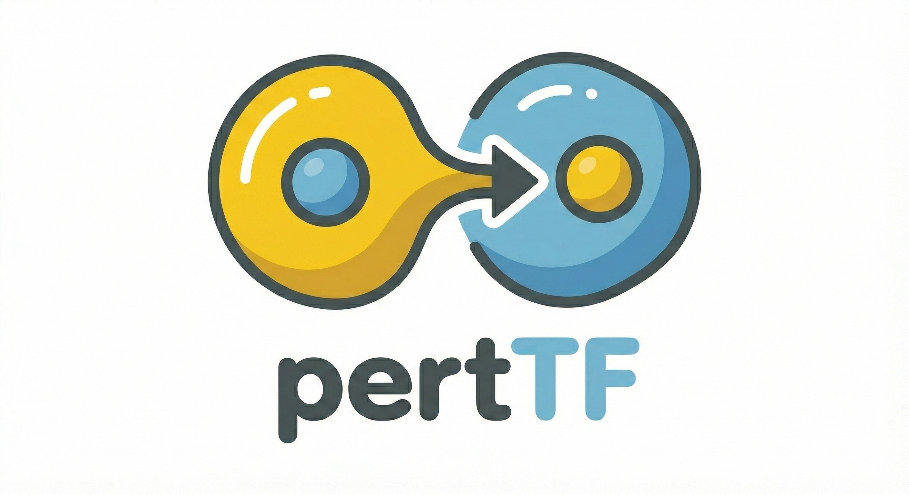

**pertTF is a transformer model designed for single-cell perturbation predictions.**
-----
# Installation
## Prerequisite environment
pertTF require `torch > 2.3.0` and `cuda > 12.0` 

best way to install is to set up a seperate envrionment with conda or mamba
```bash
# create independent environment (recommonded)
mamba create -n pertTF_env python=3.10 cuda-toolkit=12.8 'gxx>=6.0.0,<12.0' cudnn ca-certificates -y -c pytorch -c nvidia -c conda-forge

# pip install required packages
# it is best to install torch == 2.6.0 to match the flash attention compiled wheel below
# higher versions of torch may present difficulties for installing flash attention 2 
pip install torch==2.6.0 torchvision orbax==0.1.7 torchdata torchmetrics pandas scanpy numba --upgrade "numpy<1.24" datasets transformers==4.33.2 wandb torch_geometric pyarrow sentencepiece huggingface_hub omegaconf
```
flash attention is strongly recommended for training or finetuning

```bash
# flash attention 2 installation
#check ABI true/false first
python -c "import torch;print(torch._C._GLIBCXX_USE_CXX11_ABI)"
# install appropraite version (the example below is for ABI=FALSE)
pip install https://github.com/Dao-AILab/flash-attention/releases/download/v2.7.4.post1/flash_attn-2.7.4.post1+cu12torch2.6cxx11abiFALSE-cp310-cp310-linux_x86_64.whl 

# flash attention 3 installation (recommended for torch > 2.6.0 and hopper GPUs)
# To install flash attention v3 (1.5-2x speed up over v2) requires > 30mins, > 400GB RAM, 32 CPUS (aim for more than this)
git clone https://github.com/Dao-AILab/flash-attention.git
cd flash-attention
python setup.py install 
```
## pertTF installation
You can install and use pertTF in two ways.

The first way, pertTF is avaiable on PyPI. Use the following command to install pertTF:
```bash
pip install -i https://test.pypi.org/simple/ pertTF
```
The second way is suitable for you to run the most recent pertTF source code. First, fork our pertTF GitHub repository:

```bash
git clone https://github.com/davidliwei/pertTF.git
```
Then, in your python code, you can directly use the pertTF package:
```python
import sys
sys.path.insert(0, '/content/pertTF/')
```
-----------------------


# Inference Tutorial
### Preparation
```python
# first we load in some packages
from huggingface_hub import hf_hub_download, login
import scanpy as sc
import numpy as np
from pertTF.perttf.model.train_function import eval_testdata
from pertTF.perttf.model.hf import HFPerturbationTFModel
import anndata as ad

# Now download from huggingface a demo dataset
# login(token='YOUR_HF_TOKEN') #try this if download fails
hf_hub_download(repo_id="weililab/pancreatic_18clone", filename="./18clones_seurat.h5ad", repo_type='dataset', local_dir='./')
adata = sc.read_h5ad("./18clones_seurat.h5ad")
adata = ad.AnnData(X=adata.raw.X, obs=adata.obs, var=adata.raw.var)

# preprocess the data 
# log normalized expression data needs to be moved to layer under name 'X_binned'
adata.layers['X_binned'] = adata.X
# find highly variable genes (model expects a highly_variable col in adata.var)
sc.pp.highly_variable_genes(adata, n_top_genes=5000)
```

### define simple evaluation wrapper
```python
def eval_wrapper(model, adata_test, expression = False):
    res = eval_testdata(
        model, 
        adata_test, 
        None,
        train_data_dict={
        'genotype_to_index': model.genotype_to_index, 
        'vocab': model.vocab,
        'cell_type_to_index': model.cell_type_to_index
        },
        config = model.training_config, 
        mvc_full_expr = expression, 
        predict_expr = expression)
    return res
```

### classification task
```python
classify_model = HFPerturbationTFModel.from_pretrained('weililab/pertTF-tiny', use_fast_transformer = True, fast_transformer_backend = 'flash')
classify_model.to('cuda')
adata_eva = eval_wrapper(classify_model, adata)
# predicted genotype and celltypes are found here
adata_eva.obs['predicted_genotype']
adata_eva.obs['predicted_celltype']
```

### cell composition scoring
```python
lochness_model = HFPerturbationTFModel.from_pretrained('weililab/pertTF_virtual_screen_lochness', use_fast_transformer = True, fast_transformer_backend = 'flash')
lochness_model.to('cuda')
# under lochness mode, we assign a perturbation (randomly for demo)
adata.obs['genotype_next'] = np.random.choice(['FOXA2', 'PDX1'], adata.shape[0])

# inference
adata_eva = eval_wrapper(lochness_model, adata)

# predicted lochness score / lochness score after perturbation can be seen here
adata_eva.obsm['ps_pred']
adata_eva.obsm['ps_pred_next']
```

### perturbation task
```python
perturb_model = HFPerturbationTFModel.from_pretrained('weililab/pertTF-perturb_5k_mvc_only', use_fast_transformer = True, fast_transformer_backend = 'flash')
perturb_model.to('cuda')

# the perturb 5k model works on 5K HVGs that were in the training data, thus we want to use them all
# evaluation will subset your adata to the 5000 HVGs before inference
if perturb_model.training_config['sampling_mode'] == 'hvg': 
    adata.var.highly_variable = True

# to initiate perturbations set target perturbations using the genotype_next column
# assuming all cells in adata are non-perturbed (perturbed randomly for demo)
adata.obs['genotype_next'] = np.random.choice(['FOXA2', 'PDX1'], adata.shape[0])

# inference
adata_eva = eval_wrapper(perturb_model, adata, expression = True)

# corresponding perturbations are found in:
adata_eva.obs['genotype_next']
# perturbed expressions are found:
adata_eva.obsm['mvc_next_expr']
```

