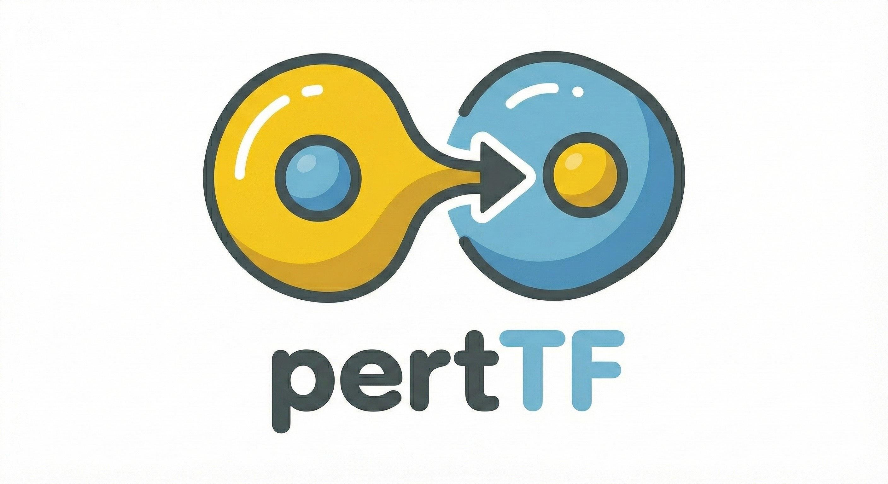

**pertTF is a transformer model designed for single-cell perturbation predictions.**
-----
# Installation
## Prerequisite environment
pertTF require `torch > 2.3.0` and `cuda > 12.0` 

best way to install is to set up a seperate envrionment with conda or mamba
```bash
# create independent environment (recommonded)
mamba create -n pertTF_env python=3.10 cuda-toolkit=12.8 'gxx>=6.0.0,<12.0' cudnn ca-certificates -y -c pytorch -c nvidia -c conda-forge

# pip install required packages
# it is best to install torch == 2.6.0 to match the flash attention compiled wheel below
# higher versions of torch may present difficulties for installing flash attention 2 
pip install torch==2.6.0 torchvision orbax==0.1.7 torchdata torchmetrics pandas scanpy numba --upgrade "numpy<1.24" datasets transformers==4.33.2 wandb torch_geometric pyarrow sentencepiece huggingface_hub omegaconf
```
flash attention is strongly recommended for training or finetuning

```bash
# flash attention 2 installation
#check ABI true/false first
python -c "import torch;print(torch._C._GLIBCXX_USE_CXX11_ABI)"
# install appropraite version (the example below is for ABI=FALSE)
pip install https://github.com/Dao-AILab/flash-attention/releases/download/v2.7.4.post1/flash_attn-2.7.4.post1+cu12torch2.6cxx11abiFALSE-cp310-cp310-linux_x86_64.whl 

# flash attention 3 installation (recommended for torch > 2.6.0 and hopper GPUs)
# To install flash attention v3 (1.5-2x speed up over v2) requires > 30mins, > 400GB RAM, 32 CPUS (aim for more than this)
git clone https://github.com/Dao-AILab/flash-attention.git
cd flash-attention
python setup.py install 
```
## pertTF installation
You can install and use pertTF in two ways.

The first way, pertTF is avaiable on PyPI and testPyPI. Use one of the following command to install pertTF:

```bash
pip install pertTF
```

or 

```bash
pip install -i https://test.pypi.org/simple/ pertTF
```


The second way is suitable for you to run the most recent pertTF source code. First, fork our pertTF GitHub repository:

```bash
git clone https://github.com/davidliwei/pertTF.git
```
Then, in your python code, you can directly use the pertTF package:
```python
import sys
sys.path.insert(0, '/content/pertTF/')
```
-----------------------

## Tutorials

All these tutorials can run on Google Colab. 

- [Inference Tutorial](demos/tutorials/INFERENCE.md): use the HuggingFace pertTF model to make inferences
- [LoRA fine tuning tutorial](demos/tutorials/LORA_FINETUNING.md) and [python notebook](demos/tutorials/lora_finetuning_tutorial.ipynb): use LoRA to fine tune the pertTF model
- [Virtual CRISPR screens](demos/tutorials/virtual_pooled_screen.ipynb) and [Google Colab notebook](https://colab.research.google.com/drive/179y3UUTXvCHGpmc7lwrOgc8I3svhnD9Z?usp=sharing): perform virtual pooled CRISPR screens between two cell populations from pertTF model
- [Train pertTF to predict composition change](demos/tutorials/train_pertTF_with__lochNESS.ipynb) and [Google Colab notebook](https://colab.research.google.com/drive/1QiWBKbMOGJwthIqZMG-BYGbengguxQ7A?usp=sharing): calculate lochNESS scores, train pertTF to predict cell compositions from lochNESS scores. In addition, this notebook demonstrates the combination of external gene information (e.g., essential genes) to train the model.
- [Inference of composition changes using CRISPRi-based Perturb-seq](demos/tutorials/Inference_using_Perturbseq.ipynb) and [Google Colab notebook](https://colab.research.google.com/drive/1OiMNI7R1SoicIO9YRDoWFLki1e3pJcHL?usp=sharing): use pertTF (lochNESS-aware during training) to infer composition changes using the predicted lochNESS scores. Include the inference of essential genes and unseen genes (like CTNNB1).
- [virtual Perturb-seq](demos/tutorials/TUTORIAL_50gene_eval.ipynb) and [Google Colab notebook](https://colab.research.google.com/drive/1J7NQMF1XlBQZ3bDooVJWgbAOilxdUUJE?usp=sharing): use pertTF to perform virtual Perturb-seq, and compare with the real CRISPRi-based Perturb-seq.

## References

- our [bioRxiv preprint](https://www.biorxiv.org/content/10.64898/2026.03.12.711379v1).
- [HuggingFace website](https://huggingface.co/weililab) hosting models and datasets.
- [Li lab website](https://weililab.org)


